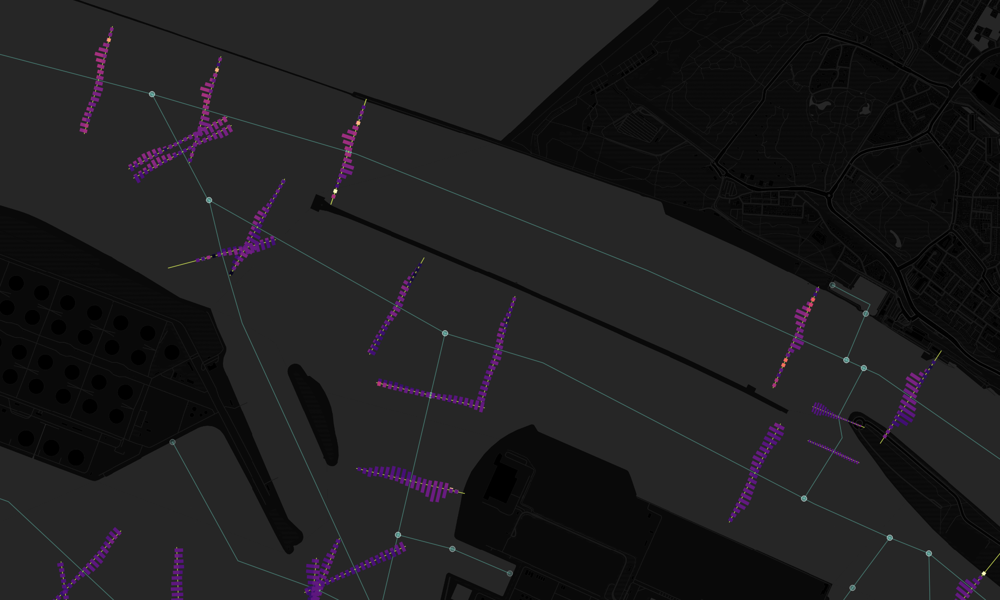
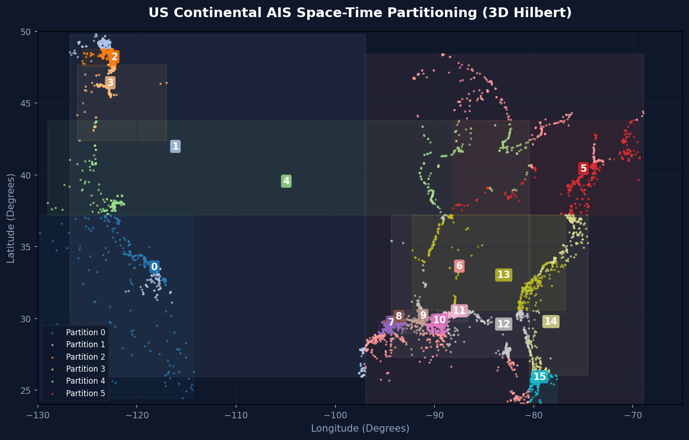
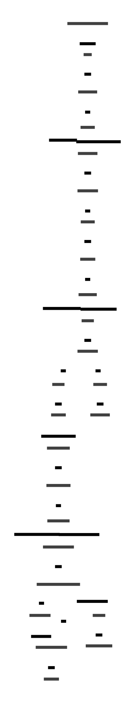

# AIS Vessel Tracks Visualization

A scalable Python pipeline to visualize AIS vessel tracks from large Parquet datasets (e.g., 11GB) as tiled, high-quality maps.


## Features

- **Scalable Processing**: Built with [Dask](https://dask.org/) and [Datashader](https://datashader.org/) to handle datasets larger than memory.
- **Seamless Tiling**: Calculates a global maximum across all tiles to ensure consistent color scaling and eliminate edge artifacts.
- **Smart Transparency**: Automatically adapts **any colormap** (e.g., Crameri Oslo) to be gradually transparent in low-density areas.
- **Flexible Pyramid**: Generates any range of zoom levels (e.g., 0-14), allowing for smooth zooming from global view to meter-scale details. For example, processing Zoom 14 on 200 nodes takes ~1.25 hours and produces ~56 GB of **compressed** data. This represents a total image size of approximately **16.7 million x 16.7 million pixels** (280 Terapixels).
- **Robust Format**: Uses Zarr for intermediate storage to handle multi-dimensional categorical data efficiently.
- **Dual Formats**: Exports both **PNG** (for display) and **Cloud Optimized GeoTIFF (COG)** (for analysis).
- **Anti-Aliasing**: Renders tracks as smooth lines (`LineString`) with anti-aliasing.
- **Configurable**: All settings (bbox, zoom, palette) are defined in `config.toml`.
- **Dynamic AEQD Local Projection**: During stop-detection and trajectorization, the pipeline inspects the dataset's CRS. If geographic coordinates (e.g. degrees in `EPSG:4326`) are provided, it dynamically projects them to a local **Azimuthal Equidistant (AEQD)** projection centered on the first ping of each track. This guarantees exact local distance (meters) and area (square meters) math for C++ CGAL rolling convex hull and flat-earth Shoelace calculations without handcoded approximations.


## Visuals

### Map Details
High-resolution, anti-aliased renderings showing vessel track density with sharp contrast at all zoom levels.


### Lateral Crossing Profiles
Normalized lateral crossing speed/frequency profiles calculated across passage lines using lateral profile binning.



### Spatio-Temporal Partitioning (Space-First Hilbert Indexing)
We partition the space-time $(x, y, t)$ coordinates using a **Spatially-Dominant (Space-First) Space-Time index**:
1. **2D Spatial Locality**: We first map the spatial $(x, y)$ coordinates to a 1D scalar using a high-precision 2D Hilbert Curve ($p=16$). This guarantees clean, non-overlapping spatial boundaries for partitions on the map.
2. **Temporal Suffix**: We left-shift the spatial index and append the temporal coordinate $t$ as the least-significant bits:
   $$\text{Index} = (\text{Hilbert2D}(x, y) \ll p) \ | \ t$$
   This ensures that sorting by this index groups points primarily by spatial region, and secondarily chronologically by time.
3. **Dynamic Splitting**: Quantile-based partition slicing guarantees that sparse regions (like the open ocean) span the full month, while highly active ports (like NYC) are cleanly split by date to prevent worker memory (OOM) issues during Dask processing. This lowers peak memory usage by **32%** during trajectorization.



### Colormaps
Custom transparent colormaps used for visualization. Any matplotlib or crameri colormap can be used.

*Crameri colormaps source: [Crameri, F. (2018). Scientific colour-maps. Zenodo. doi:10.5281/zenodo.1243862](https://doi.org/10.5281/zenodo.1243862)*

| Crameri Oslo (L=20%) | Brown / Gold |
|---|---|
|  |  |

## Troubleshooting Data

Some Marine Cadastre datasets (e.g., 2024) may have broken zip files. Fix them using:
```bash
zip -FF AISVesselTracks2024.zip --out AISVesselTracks2024-fixed.zip
```

## Installation

This project uses `uv` for dependency management.

### System Prerequisites
To build the compiled CGAL C++ convex hull extension, you need development libraries for **CGAL, Boost, GMP, and MPFR** installed on your system:

* **Ubuntu / Debian**:
  ```bash
  sudo apt-get install libcgal-dev libboost-dev libgmp-dev libmpfr-dev
  ```
* **macOS** (using Homebrew):
  ```bash
  brew install cgal boost gmp mpfr
  ```
* **Snellius (HPC)**:
  ```bash
  module load 2025 CGAL Boost GMP MPFR
  ```

### Build & Install
Install the dependencies and compile the C++ extension in editable mode:
```bash
# Sync python dependencies
uv sync

# Compile the C++ extension and install the package
uv pip install -e .
```
*(Alternatively, run `bash compile_and_test.sh` to compile the extensions and run the full test suite).*

## Usage

### 1. Preprocessing (One-time)

Convert the raw AIS data (WKB Parquet or GPKG) into a spatially partitioned GeoParquet file. This significantly speeds up rendering.

**From Parquet:**
```bash
uv run preprocess.py --input-file /path/to/raw.geoparquet --output-file /path/to/processed.geoparquet
```

**From GPKG:**
```bash
uv run preprocess.py --input-file /path/to/data.gpkg --output-file /path/to/processed.geoparquet
```
*Note: GPKG conversion via Python can be slow. For faster results, use `ogr2ogr` first:*
```bash
ogr2ogr -f Parquet -t_srs EPSG:3857 raw.geoparquet input.gpkg
uv run preprocess.py --input-file raw.geoparquet --output-file processed.geoparquet
```

### 1.5. Trajectory Processing (Voyage Segmentation & Feature Engineering)

All trajectory operations are consolidated under the `trajectory` command group:

#### Voyage Segmentation
Segment raw AIS points into trips, detect vessel stops, and compute kinematic features (speed, acceleration, turn rate) on a Dask cluster using spatial or spatiotemporal partitioning:

```bash
uv run ais-shader trajectory compute /path/to/processed.geoparquet \
    --partition-method spatiotemporal \
    --hilbert-p 16 \
    --n-partitions 128
```

Key Options:
- `-o, --output-file`: (Optional) Output trajectorized Parquet directory path (defaults to input file with `-trajectorized.geoparquet` suffix).
- `--partition-method`: Partitioning strategy, either `vessel` (MMSI group) or `spatiotemporal` (3D space-time Hilbert curve partitioning + halo lookback, default).
- `--hilbert-p`: Order of the 3D Hilbert Curve (default: `16`).
- `--n-partitions`: Number of target partitions (default: `128`).
- `--gap-threshold-hours`: Trip segmentation threshold in hours (default: `1.0`).
- `--input-crs`: Coordinate reference system of coordinates (default: `EPSG:4326`).
- `--epoch-time`: (Optional) Represent timestamps as epoch-relative times (projected to `1970-01-01`).

#### Aggregate Points to Lines
Aggregate point pings from trajectorized points into LineString/MultiLineString trajectories matching the Marine Cadastre schema:

```bash
# Automatically saves output to /path/to/trajectorized-lines.geoparquet
uv run ais-shader trajectory to-linestring /path/to/trajectorized.geoparquet
```

#### Generate Point-Pair Segments
Generate 2-point segment LineStrings connecting consecutive point pairs:

```bash
# Automatically saves output to /path/to/trajectorized-segments.geoparquet
uv run ais-shader trajectory to-segment /path/to/trajectorized.geoparquet
```

### 2. Configuration

Edit `config.toml` to customize the visualization:

```toml
[data]
input_file = "/path/to/processed.geoparquet"

[visualization]
zoom = 5
tile_size = 1024
# line_width = 1  # Anti-aliased lines (values are coverage 0-1)
line_width = 0    # Aliased lines (values are integer counts)
bbox = [-125.0, 24.0, -66.0, 49.0]  # US Bounds

[style]
colormap = "oslo"
```

**Note on GeoTIFF Values:**
- If `line_width = 1` (default for aesthetics), the output GeoTIFFs contain **anti-aliased coverage values** (typically 0.0 to 1.0 per pixel).
- If `line_width = 0`, the output GeoTIFFs contain **raw integer counts** of vessel tracks passing through each pixel. Use this for analysis.

For a detailed analysis of aliasing, saturation, and mass conservation, see [Line Width Analysis](docs/linewidth_analysis.md).

### Recommendation for Analysis vs. Visualization

**For Visualization (Default):**
Use `line_width = 1`. This produces smooth, anti-aliased lines that represent the *spatial coverage* of the vessel track. It creates visually pleasing maps where diagonal lines appear continuous and smooth.

**For Analysis (Fair Counts):**
Use `line_width = 0`. This uses Bresenham's algorithm to select exactly one pixel per step along the major axis. This produces **Integer Counts**, which is the "fairest" way to count *events* (vessel transits) without introducing fractional artifacts.
### 3. Processing (Phase 1: Render)

Generate raw count data (Zarr) for the highest zoom level (e.g., Zoom 7). Zarr is used to support multi-dimensional categorical data and parallel writes.

```bash
# Use input file from config.toml
uv run ais-shader render

# Override input file via CLI
uv run ais-shader render --input-file /path/to/other_dataset.parquet

# Use a shared Dask scheduler (recommended for large datasets)
uv run ais-shader render --scheduler tcp://127.0.0.1:8786

# Resume an interrupted run
uv run ais-shader render --resume-dir rendered/run_YYYYMMDD_HHMMSS

# Regional Rendering (e.g., NYC Port at Zoom 10)
uv run ais-shader render --bbox -74.05 40.65 -74.00 40.70 --zoom 10
```

This will output `.zarr` files to `rendered/run_YYYYMMDD_HHMMSS/zarr/`.

### 4. Post-Processing (Phase 2: Visualization)

Process the raw Zarr files to generate seamless, transparent PNGs and lower zoom levels (pyramid).

```bash
# Run post-processing on a specific run directory
uv run ais-shader postprocess --run-dir rendered/run_YYYYMMDD_HHMMSS --base-zoom 7

# Optional: Clean up intermediate Zarr files to save space
uv run ais-shader postprocess --run-dir rendered/run_YYYYMMDD_HHMMSS --base-zoom 7 --clean-intermediate
```

This script will:
1.  Calculate the **Global Max** density across all tiles to ensure consistent coloring (no seams).
2.  Render **PNGs** using a custom "Electric Blue" colormap with transparency for low counts.
3.  Generate **Pyramid** levels (Zoom 0-6) by aggregating the base zoom data.

### 5. Visualization & Testing

#### Web Server (XYZ Tiles)
To view the generated PNG tiles in a browser or QGIS as an XYZ layer:

1.  Start a simple HTTP server in the `rendered/run_.../png` directory:
    ```bash
    cd rendered/run_YYYYMMDD_HHMMSS/png
    python -m http.server 8000
    ```
2.  Open QGIS and add a new **XYZ Tiles** connection:
    -   **URL**: `http://localhost:8000/{z}/{x}/{y}.png`
    -   **Name**: AIS Tracks Local

#### QGIS (Cloud Optimized GeoTIFFs)
To view the raw data or high-resolution exports:

1.  Open QGIS.
2.  Drag and drop the `.tif` files from `rendered/run_.../tiff/` directly into the map canvas.
3.  Since they are COGs, QGIS will handle them efficiently. You can style them using "Singleband pseudocolor".
4.  **Styles**: We provide pre-configured QGIS Layer Style files (`.qml`) in `docs/styles/`:
    -   `ais_blue.qml`: The default "Electric Blue" style.
    -   `ais_dark.qml`: A high-contrast dark theme (Crameri Oslo inspired).
    -   `ais_light.qml`: A clean light theme (Crameri Batlow inspired).
    To use them: Right-click the layer -> Properties -> Symbology -> Style -> Load Style...

## Documentation
- [Architecture & Design](docs/architecture.md): Details on the technology stack, partitioning strategy, and known issues.
- **Pipeline Schematic**:
  

## Pipeline Overview

1.  **Data Loading**: Reads the preprocessed GeoParquet file using `dask-geopandas`.
2.  **Tiling**: Calculates the list of Web Mercator tiles for the configured BBox and Zoom.
3.  **Processing**: For each tile:
    - Filters the dataset using spatial indexing (`.cx`).
    - Computes the subset to a local GeoDataFrame.
    - Renders the tracks using Datashader (`cvs.line`).
    - Applies the colormap and transparency.
    - Applies the colormap and transparency.
### Output Structure

The pipeline generates the following directory structure:

```
rendered/
  run_YYYYMMDD_HHMMSS/
    metadata.json       # Run configuration and details
    zarr/               # Intermediate Zarr files (compressed)
      tile_7_*.zarr     # Base zoom tiles
      tile_6_*.zarr     # aggregated tiles
      ...
    png/                # Visualized PNG tiles
      7/                # Zoom 7
      6/                # Zoom 6
      ...
    tiff/               # Cloud Optimized GeoTIFFs (if --cogs used)
      tile_7_*.tif
```

### Storage Estimates

Estimates based on **Marine Cadastre** AIS data (https://hub.marinecadastre.gov/), using `zlib` compression (level 5) and `int32` data types:
*   **Zoom 7**: ~93 MB (143 tiles)
*   **Zoom 10**: ~5.7 GB (12,525 tiles)


## Project Structure

- `src/`: Source code modules.
    - `data_loader.py`: Data loading logic.
    - `renderer.py`: Rendering and export logic.
- `visualize_tracks.py`: Main entry point.
- `preprocess.py`: Data preprocessing script.
- `config.toml`: Configuration file.

## References & Previous Work

This project builds upon research and visualization techniques developed at TU Delft.

- **"The North Sea is ready for its close-up"** (2021). *TU Delft Stories*. [Link](https://www.tudelft.nl/en/2021/citg/hydraulic-engineering/the-north-sea-is-ready-for-its-close-up)
- **Solange van der Werff** (PhD Candidate, TU Delft). Research on "Merging Multiple Perspectives to Extend Views on Nautical Systems", including high-resolution AIS visualization and safety monitoring.

