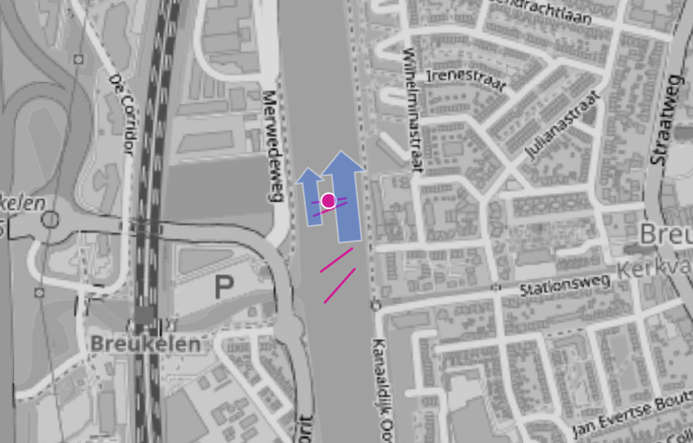

# Inland Vessel Encounter Detection & Stationary Object Methodology

This document details the mathematical framework, algorithmic design, and workflow used by `ais-shader` to detect vessel encounters (head-on, overtaking, parallel sailing, crossing, and encounters with stationary obstacles) on inland waterways such as the Mississippi River, Waal, and Rhine.

---

## 1. Overview & Architecture

Detecting encounters in inland waterways poses unique challenges compared to open-sea navigation:
1. **River Bends & Heading Divergence ("The False Crossing Problem")**: Two ships navigating opposite lanes around a sharp river bend can have perpendicular or diverging compass headings ($90^\circ$). Standard heading-angle classification classifies these safe navigations as severe "crossings".
2. **Stationary Ships as Objects / Obstacles**: Rivers are densely occupied by moored vessels, fleeting barges, and anchored tows. Treating every stationary fix as a regular moving ship generates millions of false stationary-stationary encounters, while omitting them obscures navigational risk when a moving vessel passes within close proximity to a berthed obstacle.
3. **Continuous High-Frequency Dynamics**: AIS reports arrive at discrete, asynchronous timestamps. Computing exact Closest Point of Approach (CPA) requires continuous analytic kinematics rather than discrete ping-to-ping distance sampling.

### End-to-End Workflow Diagram

```mermaid
flowchart TD
    subgraph S1["1. Preprocessing & Trajectorization"]
        RAW[("Raw AIS Data\n(CSV / Parquet)")] --> CONV["ais-shader convert csv\n(--bbox, --start-time, --end-time)"]
        CONV --> PTS[("Normalized AIS Points\n(UTC, Hive Date Partitioned)")]
        PTS --> TRAJ["ais-shader trajectory compute\n(Voyage segmentation & outlier filtering)"]
        TRAJ --> SEGM["ais-shader trajectory to-segment\n(--metric-crs EPSG:32615)"]
        SEGM --> SEGS_GEO[("Metric 2-Point Segments\n(segments_utm15n.geoparquet)")]
    end

    subgraph S2["2. Waterway Fairway Axis Modeling"]
        MARKERS[("Fairway Data\n(USACE River Miles / Centerline)")] --> BUILD["ais-shader fairway build-us-centerline\n(Cubic B-Spline fitted centerline)"]
        BUILD --> AXIS[("Metric Fairway Centerline\n(fairway_centerline_utm15n.geoparquet)")]
        AXIS --> PROJ["Frenet-Serret Projection\n(cKDTree O(log N) lookup)"]
        SEGS_GEO --> PROJ
        PROJ --> ANNOT["Kinematic Fairway Annotation\n(s: chainage, n: cross-track\nv_s: along-channel, v_n: cross-channel\ndirection: upbound/downbound/crossing/stationary)"]
    end

    subgraph S3["3. Stationary Ship Handling (Dual Representation)"]
        ANNOT --> STAT_SPLIT{"v < min_speed (0.5 m/s)\nor fairway_direction == 'stationary'"}
        STAT_SPLIT -->|"Yes"| STAT_EXTRACT["Stationary Vessel Extraction\n(extract_stationary_vessels)\n- Dwell location & duration\n- Fairway chainage (s) & cross-track (n)\n- Vessel dimensions (L, W)"]
        STAT_EXTRACT --> STAT_CATALOG[("stationary_vessels.geoparquet\n(Static Obstacle / Dwell Catalog)")]
        ANNOT --> CAND_POOL["Segment Candidate Pool\n(Tagged with is_stationary)"]
    end

    subgraph S4["4. Spatio-Temporal Candidate Pruning"]
        CAND_POOL --> TIME_BIN["Temporal Sliding Windows\n(e.g., 15-minute time bins)"]
        TIME_BIN --> STR_TREE["Shapely STRtree 2D Spatial Index\n(Buffered envelope: max_distance_m)"]
        STR_TREE --> PAIRS["Candidate Pairs\n(mmsi_1 < mmsi_2 & temporal overlap)"]
    end

    subgraph S5["5. Analytical CPA & Role Filtering"]
        PAIRS --> CPA["Analytical Continuous CPA Solver\n- Solve tau* = -(R0 . delta_v) / ||delta_v||^2\n- Exact CPA time, distance, midpoint"]
        CPA --> CPA_DIST{"d_cpa <= max_distance_m?"}
        CPA_DIST -->|"No"| PRUNE["Prune Candidate"]
        CPA_DIST -->|"Yes"| ROLE["Assign stationary_role\n('none', 'vessel_1', 'vessel_2', 'both')"]
        ROLE --> STAT_FILTER{"--exclude-stationary policy"}
        STAT_FILTER -->|"'both' & role == 'both'"| PRUNE
        STAT_FILTER -->|"'any' & role in ('vessel_1','vessel_2','both')"| PRUNE
        STAT_FILTER -->|"Keep"| CLASSIFY
    end

    subgraph S6["6. Fairway-Aligned Encounter Classification"]
        CLASSIFY["Fairway Encounter Classifier"]
        CLASSIFY -->|"Opposite (upbound vs downbound)"| HEADON["Head-On"]
        CLASSIFY -->|"Same dir + along-fairway order flip"| OVERTAKE["Overtaking\n(Identifies overtaking & overtaken MMSI)"]
        CLASSIFY -->|"Same dir + no order flip"| PARALLEL["Parallel Sailing\n(Co-sailing abreast)"]
        CLASSIFY -->|"Transversal cross-channel speed"| CROSSING["Crossing"]
        CLASSIFY -->|"One stationary, one moving"| STAT_PASS["Passing Stationary Obstacle\n(Moving vessel passing moored ship)"]
    end

    subgraph S7["7. Temporal Aggregation & Playback"]
        HEADON & OVERTAKE & PARALLEL & CROSSING & STAT_PASS --> MERGE["Dyad Temporal Merging\n(Group consecutive alerts within merge_gap_minutes\nRetain global CPA minimum)"]
        MERGE --> ENC_EVENTS[("encounters.geoparquet\n(Encounter Events Table)")]
        
        ENC_EVENTS --> TS_BUILD["Dynamic Time Series Generator\n(generate_encounter_timeseries)"]
        SEGS_GEO --> TS_BUILD
        TS_BUILD --> TS_LINES[("encounter_timeseries.geoparquet\n(Connecting Lines @ step_seconds + CPA)")]
    end
```



---

## 2. Waterway Centerline & Frenet-Serret Coordinates

To eliminate heading distortion across river meanders, vessel positions and trajectories are mapped onto a 1D curvilinear coordinate system $(s, n)$ defined along the fairway centerline:

- $s \in [0, L]$: **Along-channel chainage** (distance in meters along the fairway centerline from a reference origin, e.g., river mouth or upstream marker).
- $n \in \mathbb{R}$: **Cross-channel lateral offset** (perpendicular distance in meters from the centerline; signed positive for starboard / right bank, negative for port / left bank).

### cKDTree Projection ($O(\log N)$)
Given a metric point $P = (x, y)$ in a conformal Cartesian projection (e.g. UTM Zone 15N, `EPSG:32615`):
1. Query a `scipy.spatial.cKDTree` built over the centerline vertices to find the $k=4$ nearest vertices.
2. Form candidate centerline segments $A_i B_i$ and project $P$ orthogonally onto each segment:
   $$u_i = \text{clamp}\left(\frac{(P - A_i) \cdot (B_i - A_i)}{\|B_i - A_i\|^2}, 0, 1\right)$$
3. The closest projection point $P^* = A + u (B - A)$ defines the distance:
   $$\text{dist} = \|P - P^*\|$$
4. Chainage is evaluated as:
   $$s = s_A + u \cdot \|B - A\|$$
5. Lateral offset $n$ takes its sign from the 2D cross product between the fairway tangent $\vec{T} = B - A$ and vector $\vec{V} = P - A$:
   $$n = \text{dist} \times \text{sgn}(T_x V_y - T_y V_x)$$

### Curvilinear Kinematics
For a 2-point vessel segment with duration $\Delta t = t_{\text{end}} - t_{\text{start}}$:
- **Along-channel velocity**: $v_s = \frac{s_{\text{end}} - s_{\text{start}}}{\Delta t}$
- **Cross-channel velocity**: $v_n = \frac{n_{\text{end}} - n_{\text{start}}}{\Delta t}$

**Fairway Direction Classification**:
- `stationary`: $\Delta t \le 10^{-3}\text{ s}$ or $(|v_s| < 0.25\text{ m/s} \text{ and } |v_n| < 0.25\text{ m/s})$
- `crossing`: $|v_n| > 1.5 \max(|v_s|, 0.1) \text{ and } |v_n| > 0.5\text{ m/s}$
- `upbound`: $v_s > 0$
- `downbound`: $v_s < 0$

---

## 3. Treating Stationary Ships as Objects

In inland navigation, stationary vessels (barges moored in fleeting areas, vessels waiting at lock approaches, anchored ships) function as **physical obstacles** rather than navigationally active interaction partners.

### Dual Representation
The engine treats stationary vessels via two distinct, complementary mechanisms:

#### A. Static Obstacle & Dwell Catalog (`extract_stationary_vessels`)
All segments where $v < 0.5\text{ m/s}$ or `fairway_direction == 'stationary'` are isolated and exported to `stationary_vessels.geoparquet`. Each record contains:
- `MMSI`, `trip_id`, `VesselType`, `VesselGroup`, `Length`, `Width`
- Dwell time range: `segment_start_time` to `segment_end_time`
- Fairway location: `chainage_m`, `chainage_km`, `cross_track_m`
- Dwell geometry: Centroid or footprint Point

#### B. Dynamic Encounter Role Tracking (`stationary_role`)
During pairwise encounter candidate evaluation, each vessel's instantaneous speed at CPA is checked ($v < v_{\text{min}}$):
- `stationary_role = 'none'`: Both vessels are moving (standard ship-to-ship encounter).
- `stationary_role = 'vessel_1'`: Vessel 1 is stationary; Vessel 2 is moving past it.
- `stationary_role = 'vessel_2'`: Vessel 2 is stationary; Vessel 1 is moving past it.
- `stationary_role = 'both'`: Both vessels are stationary (e.g. moored side-by-side in a fleeting area).

#### Filtering Policy (`--exclude-stationary`)
- **`both` (Default)**: Discards pairs where both vessels are stationary (`stat_role == 'both'`). This filters out hundreds of thousands of irrelevant barge-barge proximity pairs while **preserving moving vessels passing stationary vessels as obstacle encounters**.
- **`any` / `all`**: Restricts encounters exclusively to moving-vs-moving ships.
- **`none`**: Retains all proximity events, including moored barge clusters.

---

## 4. Analytical Closest Point of Approach (CPA)

Instead of discretizing trajectories into fine time steps to find minimum distance, `ais-shader` calculates the exact mathematical minimum distance between two time-overlapping linear segments analytically.

Let two vessels have linear trajectories over their mutual overlap window $[t_{\text{start}}, t_{\text{end}}]$ with duration $\Delta t = t_{\text{end}} - t_{\text{start}}$:
$$\vec{r}_1(t) = \vec{r}_{1,0} + \vec{v}_1 \tau, \quad \vec{r}_2(t) = \vec{r}_{2,0} + \vec{v}_2 \tau \quad (\tau \in [0, \Delta t])$$

The relative position vector is:
$$\vec{R}(\tau) = \vec{r}_1(\tau) - \vec{r}_2(\tau) = \vec{R}_0 + \Delta\vec{v}\,\tau$$
where $\vec{R}_0 = \vec{r}_{1,0} - \vec{r}_{2,0}$ and $\Delta\vec{v} = \vec{v}_1 - \vec{v}_2$.

The squared distance function is quadratic in $\tau$:
$$D^2(\tau) = \|\vec{R}_0 + \Delta\vec{v}\,\tau\|^2 = \|\Delta\vec{v}\|^2 \tau^2 + 2 (\vec{R}_0 \cdot \Delta\vec{v})\,\tau + \|\vec{R}_0\|^2$$

Setting the derivative $\frac{d}{d\tau} D^2(\tau) = 0$ yields the unconstrained extremum:
$$\tau^* = -\frac{\vec{R}_0 \cdot \Delta\vec{v}}{\|\Delta\vec{v}\|^2}$$

Clamping to the overlap interval $[0, \Delta t]$:
$$\tau_{\text{cpa}} = \max(0, \min(\Delta t, \tau^*))$$

The exact CPA attributes are then computed:
- **CPA Timestamp**: $t_{\text{cpa}} = t_{\text{start}} + \tau_{\text{cpa}}$
- **CPA Distance**: $d_{\text{cpa}} = \|\vec{R}(\tau_{\text{cpa}})\|$
- **CPA Midpoint**: $P_{\text{cpa}} = \frac{\vec{r}_1(\tau_{\text{cpa}}) + \vec{r}_2(\tau_{\text{cpa}})}{2}$

---

## 5. Fairway-Aligned Encounter Classification

Standard compass heading classification fails along meanders. When a `fairway_axis` is present, classification uses along-channel kinematics:

### Relative Fairway Directions
- **`head-on`**: Opposite directions along the fairway (`upbound` vs `downbound`). Regardless of compass headings at a sharp bend, vessels navigating in opposite channel directions are strictly head-on encounters.
- **`crossing`**: Either vessel has `fairway_direction == 'crossing'` (transverse channel crossing, e.g. ferry or crossing tow).
- **`overtaking` vs `parallel_sailing`**: Both vessels navigate in the same fairway direction (`upbound` vs `upbound` or `downbound` vs `downbound`). We evaluate the along-track spatial order:
  $$\Delta s_{\text{start}} = s_{1,\text{start}} - s_{2,\text{start}}, \quad \Delta s_{\text{end}} = s_{1,\text{end}} - s_{2,\text{end}}$$
  - If $\Delta s_{\text{start}} \cdot \Delta s_{\text{end}} < 0$, the spatial order flipped during the encounter $\rightarrow$ **`overtaking`**.
  - If a significant along-fairway speed difference exists ($|\Delta v_s| \ge 0.5\text{ m/s}$) and the vessels close past each other $\rightarrow$ **`overtaking`**.
  - The faster vessel is flagged as `overtaking_mmsi` and the slower as `overtaken_mmsi`.
  - Otherwise, vessels are sailing abreast at similar speeds $\rightarrow$ **`parallel_sailing`**.
- **Passing Stationary Obstacle**: When one vessel is stationary and the other is moving, the event records `stationary_role` (`vessel_1` or `vessel_2`) and documents the moving ship passing a static waterway obstacle.

---

## 6. Proximity Dyad Merging

Because continuous vessel tracks are split into consecutive 2-point segments, two vessels passing each other remain within `max_distance_m` across several consecutive segments.

The merger (`_merge_encounters`):
1. Groups consecutive encounters between the same vessel pair $(\text{mmsi}_1, \text{mmsi}_2)$ where the gap between the end of one record and the start of the next is $\le \text{merge\_gap\_minutes}$ (default: 10 minutes).
2. Spans the merged encounter duration from the earliest `start_time` to the latest `end_time`.
3. Selects the global minimum distance $d_{\text{cpa}}$ across the entire encounter window and retains its corresponding CPA coordinates and timestamp.
4. Validates whether an overtaking sequence occurred across the entire multi-segment window.

---

## 7. Dynamic Time Series Playback

To visualize and inspect encounters dynamically in GIS software (QGIS Temporal Controller, Kepler.gl, ArcGIS Pro), `generate_encounter_timeseries` samples both vessels' positions synchronously throughout each encounter:

1. For each encounter event, generates a uniform temporal grid from `start_time` to `end_time` at intervals of `step_seconds` (e.g. every 30 seconds), explicitly including the exact `cpa_time`.
2. Evaluates the instantaneous coordinates of both vessels via piecewise linear trajectory lookups.
3. Constructs a 2-point `LineString` connecting Vessel 1 to Vessel 2 at each timestamp.
4. Computes instantaneous distance, channel chainages ($s_1, s_2$), cross-track offsets ($n_1, n_2$), along-channel separation ($|s_1 - s_2|$), and sets `is_cpa = True` at the moment of closest approach.

---

## 8. CLI Usage Example

### Running Encounter Detection on Mississippi River AIS Data
```bash
# 1. Build metric fairway centerline from USACE river markers
uv run ais-shader fairway build-us-centerline \
    /data/marine-cadastre/mississippi_markers.geojson \
    -o /data/mississippi_fairway_centerline_utm15n.geoparquet \
    --river-name "MISSISSIPPI-LO" \
    --metric-crs "EPSG:32615"

# 2. Extract and project 1-day trajectory segments
uv run ais-shader trajectory to-segment \
    /data/mississippi_trajectories.parquet \
    -o /data/mississippi_segments_utm15n.geoparquet \
    --metric-crs "EPSG:32615"

# 3. Detect encounters, extract stationary obstacles, and build dynamic time series
uv run ais-shader events encounters \
    /data/mississippi_segments_utm15n.geoparquet \
    -o /data/mississippi_encounters.geoparquet \
    --fairway-markers /data/mississippi_fairway_centerline_utm15n.geoparquet \
    --metric-crs "EPSG:32615" \
    --time-bin-minutes 15.0 \
    --max-distance 600.0 \
    --merge-gap-minutes 10.0 \
    --exclude-stationary both \
    --stationary-file /data/mississippi_stationary_vessels.geoparquet \
    --timeseries-file /data/mississippi_encounter_timeseries.geoparquet \
```

---

## 9. Dutch Inland Waterways (EURIS & RWS FIS) Integration

The encounter methodology is fully adapted to Dutch inland waterways using **Rijkswaterstaat (RWS) Fairway Information Services (FIS VNDS)** and **EURIS AIS** live stream crawls.



*Figure: Two cargo vessels navigating northbound along the Amsterdam-Rijnkanaal near Breukelen. The CPA midpoint (magenta circle) and dynamic synchronous connecting lines (magenta lines) show the overtaking event visualized in QGIS using embedded GeoPackage layer styles.*

### Multi-Layer GeoPackage Export
Instead of loose parquet files, the Dutch pipeline packages all fairway and encounter layers into a self-contained GeoPackage in Dutch National Grid coordinates (`EPSG:28992` - Amersfoort / RD New):

1. `fairway_centerline`: Continuous 1D navigation axis constructed from RWS ArcGIS MapServer Layer 58 (`vaarwegvak`).
2. `fairway_sections`: Official RWS fairway sections with kilometer markings (`routekmbegin` to `routekmend`) and fairway names.
3. `trajectorized_points`: Point fixes with boat dimensions, speed, and heading/COG arrows.
4. `trajectories`: Continuous voyage LineStrings per trip with `TrackStartTime` and `TrackEndTime`.
5. `segments`: Consecutive point-to-point line segments classified by vessel group.
6. `stationary_vessels`: Moored and anchored vessels identified as potential navigation obstacles.
7. `encounters`: Detected CPA encounter events (overtakings, head-on meetings, crossings, stationary passings).
8. `timeseries`: Synchronous dynamic connecting lines between interacting vessels at 15s intervals.

Layer symbology and QGIS Temporal Controller settings are directly embedded into the `.gpkg` SQLite `layer_styles` table.
